 

Using Wireshark

    姓名：欧翌昕

    专业：软件工程

    学号：3190104783

    课程名称：信息安全原理

    指导老师：胡天磊

    2020~2021春夏学期 2020 年 4 月 18 日

---

## 一、实验目的

学习使用网络数据抓包软件 Wireshark，对互联网进行数据抓包，巩固对所学知识的理解

## 二、实验内容

1. 下载并安装 Wireshark
2. 使用 Wireshark 捕获连接到 [**http://www.zju.edu.cn**](http://www.zju.edu.cn/) 过程中发送和接收的所有报文
3. 对捕获到的报文中的内容进行分析

## 三、实验环境

|         操作系统          |    抓包工具     |
| :-----------------------: | :-------------: |
| Ubuntu 20.04.2 LTS x86_64 | Wireshark 3.2.3 |

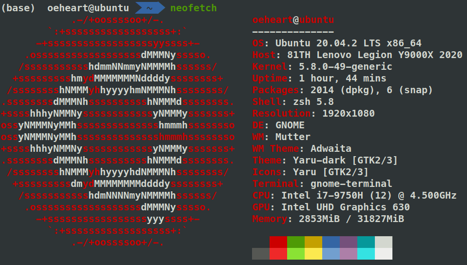

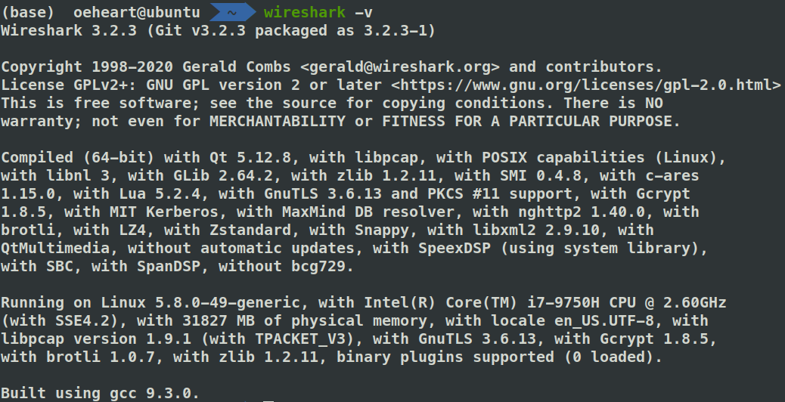

## 四、实验过程

下载并安装抓包工具 Wireshark 后，进入软件页面，点击工具栏中第一个按钮开始抓包。

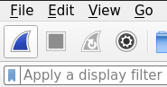

在浏览器中搜索框中输入地址 [**http://www.zju.edu.cn**](http://www.zju.edu.cn/) 并进行跳转，此时 Wireshark 已经捕捉此过程中捕统发送和接收的每一个报文。停止捕获报文并导出捕获结果进行分析。观察发现前四个报文的使用协议均是域名解析协议(DNS，Domain Name System)。

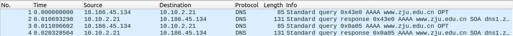

这是因为如果想要使我的计算机和 [**http://www.zju.edu.cn**](http://www.zju.edu.cn/) 建立连接并进行通信的话，需要获得 [**http://www.zju.edu.cn**](http://www.zju.edu.cn/) 的 IP 地址，这个过程需要由 DNS 协议来完成。并且由于 DNS 的设计原因，本地 DNS 可能无法给我提供正确的 IP 地址，那么它就需要在互联网上搜索多个 DNS 服务器，来找到网站的正确 IP 地址。

容易观察出1帧和3帧均为 DNS 请求帧，1帧对应的请求报文如下。

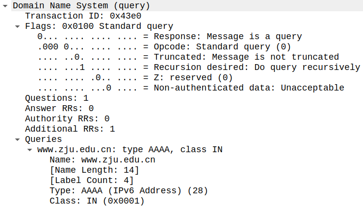

分析请求报文发现过程中使用的是标准递归查询，请求的域名为 www.zju.edu.cn，域名类型为 AAAA 即 IPv6地址，地址类型为 IN 即互联网地址。

2帧和4帧均为 DNS 响应帧，2帧对应的响应报文如下，其中 Athoritative nameservers 区段包含权威域名服务器资源记录。

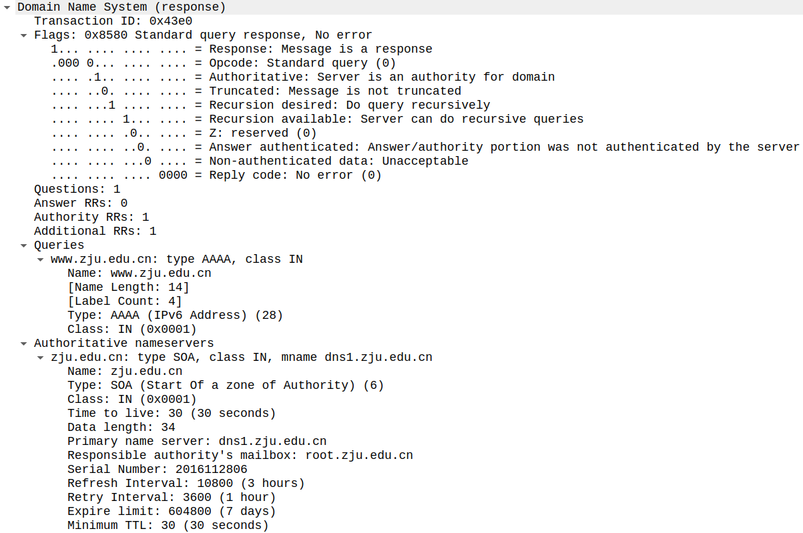

经 DNS 协议获得 www.zju.edu.cn 的 IP 地址为 10.203.6.122，可通过本机的 `ping` 命令进一步验证。

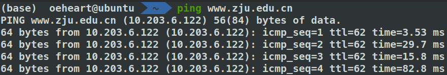

确定目标服务器 IP 后，在 WIreshark 软件页面上方设置过滤器条件为 ip.addr == 10.203.6.122，即过滤出来源IP或者目标IP为 10.203.6.122 的所有报文，方便后续的进一步分析。

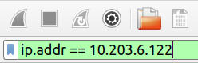

浏览器得到目标服务器的 IP 地址后，将会和目标服务器建立连接来传输信息。这里可以使用很多种 Internet 协议，但是 HTTP 协议建立连接所使用的运输层协议是 TCP 协议。所以这一步骤是浏览器与目标服务器建立 TCP 连接的过程。

TCP 的连接建立需要经过 TCP/IP 的三次握手，三次握手的过程其实就是浏览器和服务器交换 SYN 同步和 ACK 确认消息的过程。

观察发现5-7帧即 TCP 三次握手阶段对应的报文。

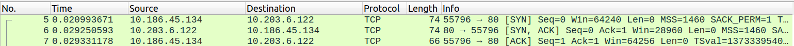

TCP 第一次握手用户向服务器发送同步请求,将获得包括 Src, Dst, Port 等信息，并将其中 Flags 字段的 Syn 位置为 Set。服务端进程准备好接收来自外部的 TCP 连接。然后服务端进程处于 `LISTEN` 状态，等待客户端连接请求。客户端进入 `SYN-SEND` 状态。5帧对应的报文如下。

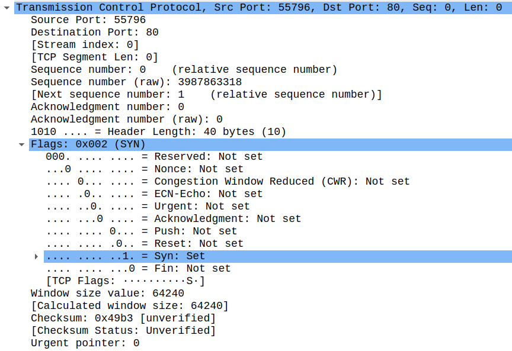

TCP 第二次握手服务器收到客户端连接后，需要确认客户端的报文段。服务器向用户回复一个 ACK 包 ，其中 Flag 字 段的 Syn 和 Acknowledgment 字段置为 Set。TCP 服务器进入 `SYN-RECEIVED`(同步收到)状态。6帧对应的报文如下。

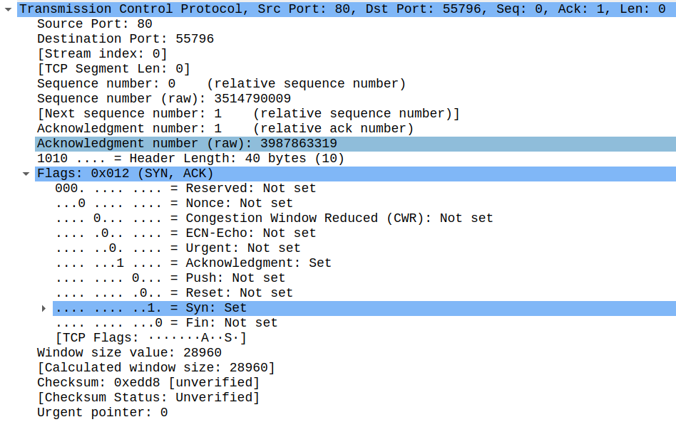

TCP 第三次握手客户端在收到服务器发出的响应后，还需要给出确认连接。客户向服务器发送一个 ACK 包。这时，客户端进入 `ESTABLISHED`(已连接)状态。7帧对应的报文如下。

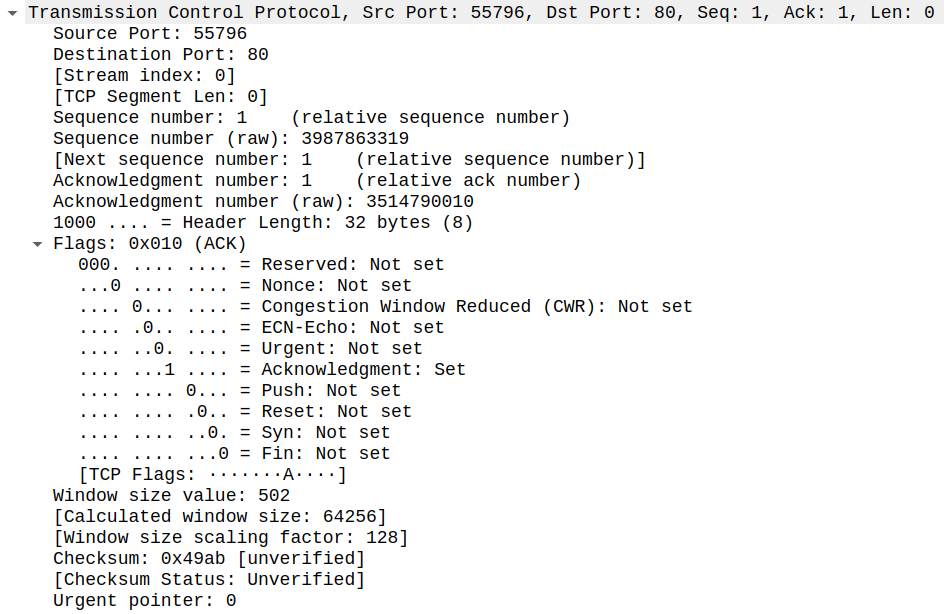

这样三次握手建立连接的阶段就完成了，双方可以直接通信了。客户端发送 HTTP 请求。

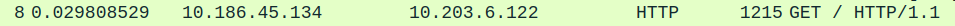

HTTP/1.1 定义的请求方法有8种：GET, POST, PUT, DELETE, PATCH, HEAD, OPTIONS, TRACE。最常用的两种是 GET 和 POST。8帧对应的请求报文如下。

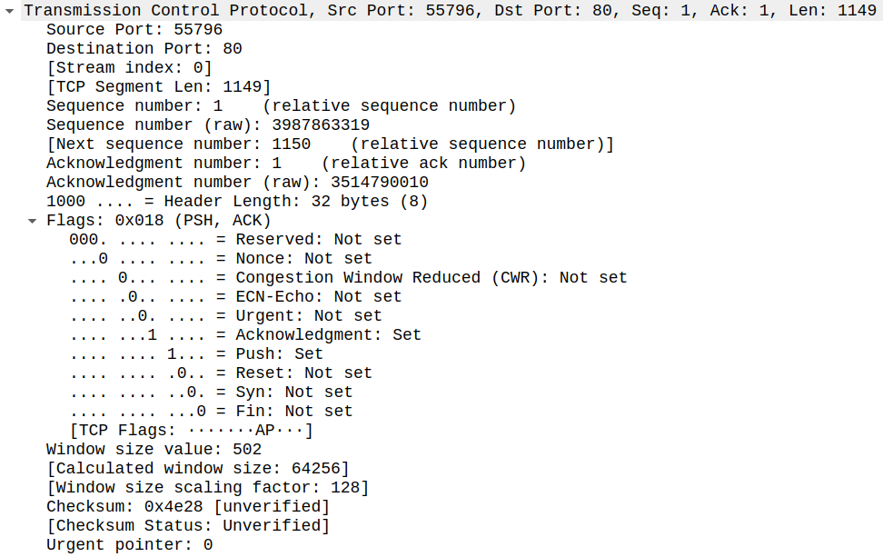

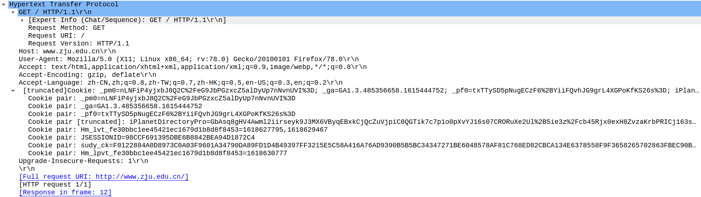

服务器收到请求发送 ACK。

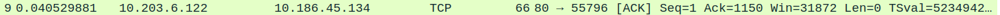

9帧对应的响应报文如下。

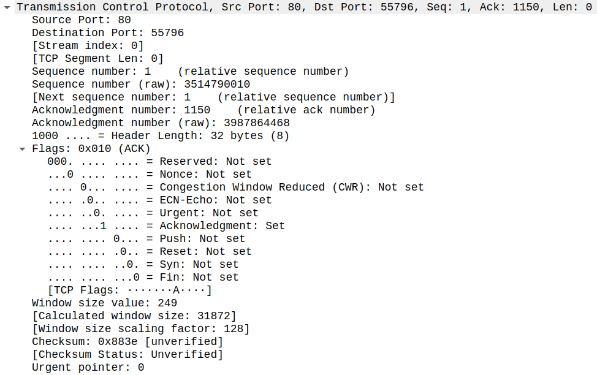